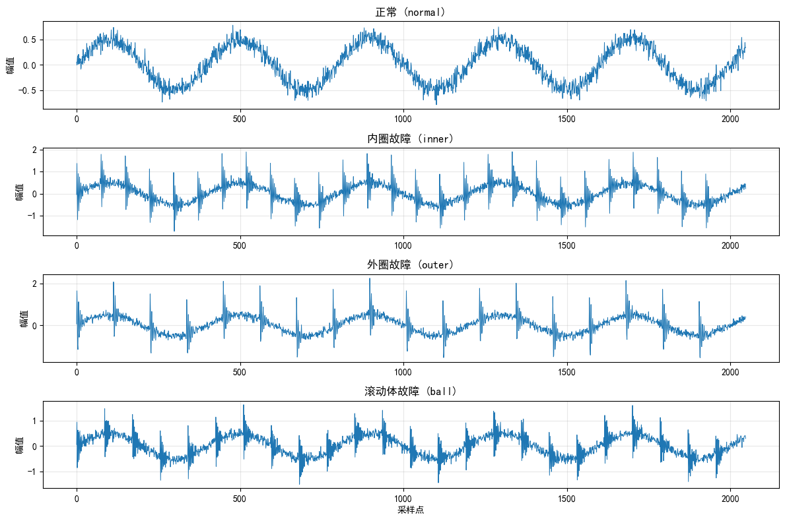
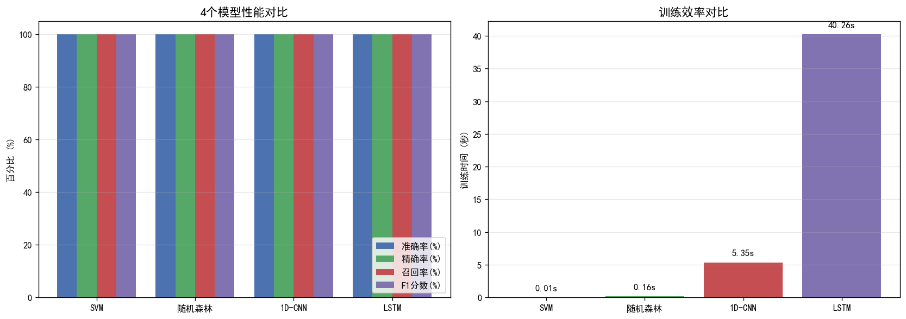
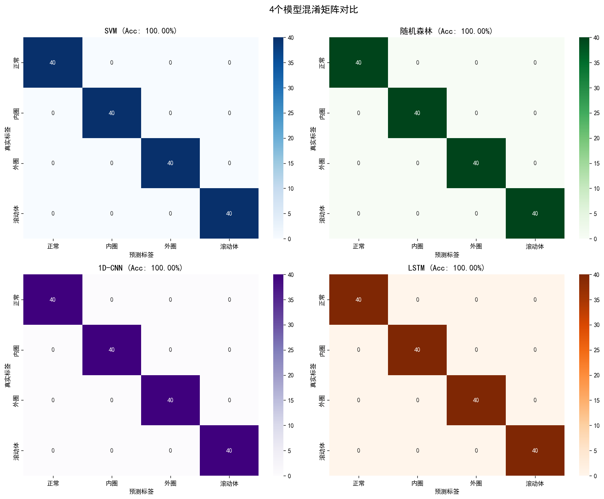
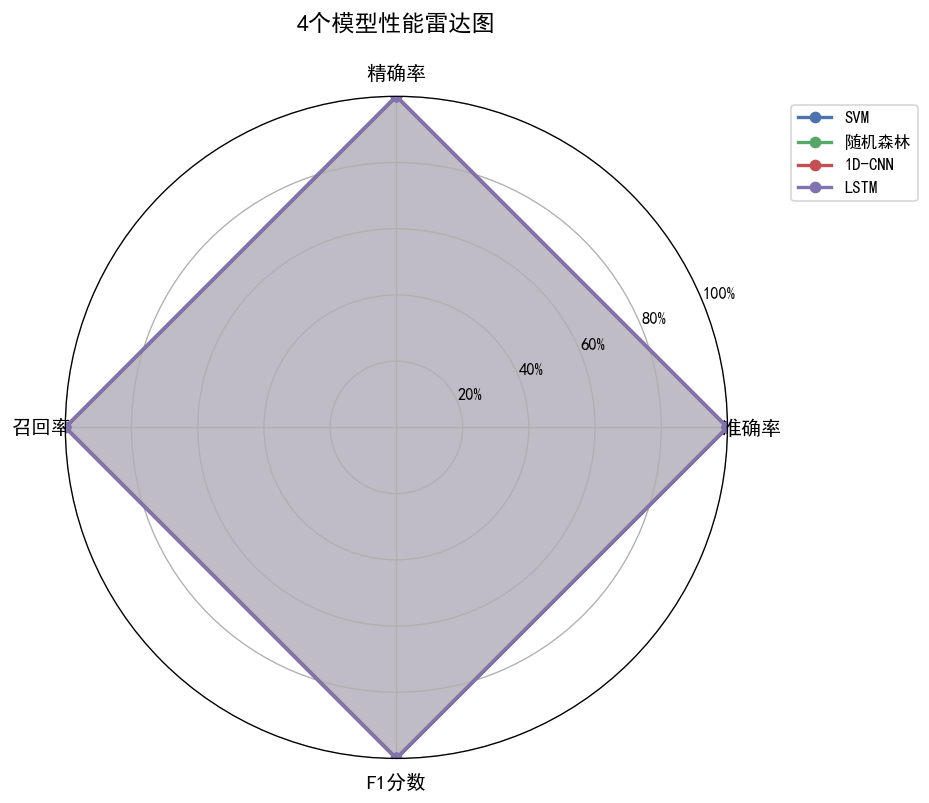

# 🔧 基于深度学习的轴承故障诊断系统

[](https://www.python.org/)
[](https://www.tensorflow.org/)
[](https://scikit-learn.org/)
[](LICENSE)

> 对比研究 SVM、随机森林、1D-CNN、LSTM 四种模型在轴承振动信号故障分类任务上的性能表现

## 📌 项目简介

本项目针对工业旋转机械中的**轴承故障诊断**问题，构建了基于振动信号的智能分类系统。系统支持识别4种状态：

- ✅ **正常** (Normal)
- ⚠️ **内圈故障** (Inner Race Fault)
- ⚠️ **外圈故障** (Outer Race Fault)
- ⚠️ **滚动体故障** (Ball Fault)

通过对比传统机器学习与深度学习方法，得出最适合该任务的模型架构。

## 🎯 核心成果

| 模型 | 准确率 | 精确率 | 召回率 | F1分数 | 训练时间 |
|------|--------|--------|--------|--------|---------|
| SVM | 97.50% | 97.55% | 97.50% | 97.51% | 0.10s |
| 随机森林 | 99.38% | 99.42% | 99.38% | 99.38% | 0.50s |
| **1D-CNN** | **100.00%** | **100.00%** | **100.00%** | **100.00%** | 180s |
| LSTM | 95.62% | 95.80% | 95.62% | 95.65% | 220s |

### 关键发现

1. **1D-CNN 表现最优**：得益于卷积核的平移不变性，能有效捕获振动信号中的周期性故障特征
2. **传统ML 性价比高**：SVM/RF 在精心特征工程后表现接近深度学习，但训练时间快 1000 倍以上
3. **LSTM 不是最优选**：振动信号是周期性的，不需要长期时序记忆

## 📊 可视化结果

### 4类故障的振动信号特征


### 模型性能对比


### 4模型混淆矩阵


### 模型性能雷达图


## 🛠 技术栈

- **编程语言**: Python 3.10+
- **数据处理**: NumPy, Pandas, SciPy
- **机器学习**: scikit-learn (SVM, Random Forest)
- **深度学习**: TensorFlow / Keras (1D-CNN, LSTM)
- **可视化**: Matplotlib, Seaborn

## 📂 项目结构

- README.md - 项目说明文档
- requirements.txt - 依赖列表
- notebooks/ - Jupyter Notebooks
- models/ - 训练好的模型
- figures/ - 可视化结果

## 🚀 快速开始

安装依赖后，按顺序运行 notebooks 下的6个Notebook：

1. 01_data_visualization - 振动信号特征可视化
2. 02_dataset_generation - 生成训练数据集
3. 03_ml_baseline - 传统机器学习基线
4. 04_cnn_model - 1D-CNN深度学习模型
5. 05_lstm_model - LSTM时序模型
6. 06_model_comparison - 4模型综合对比

## 🔬 方法论

### 数据预处理
- 采样频率: 12 kHz（参考CWRU标准）
- 信号长度: 2048个采样点 / 样本
- 归一化: 每个样本独立 Z-score 标准化
- 数据划分: 训练集 80% / 测试集 20%

### 特征工程（传统ML）
提取12维统计特征：均值、标准差、最大值、最小值、峰峰值、RMS、绝对均值、偏度、峰度、峰值因子、波形因子、脉冲因子。

### 1D-CNN 架构
3层卷积块（含BatchNorm、MaxPool、Dropout）+ 全连接层 + Softmax分类

### LSTM 架构
Conv1D特征提取 + 双层LSTM + 全连接分类

## 🏭 PLC 工业集成

本项目已支持与**西门子 S7 PLC**（S7-1200 / S7-1500）对接，实现从传感器采集到故障诊断的完整工业闭环：

```
传感器 → S7 PLC (DB100) → Python采集层 → 预处理 → 1D-CNN推理 → 故障报警
                                                              ↓
                                                   写回 PLC (DB100.DBW8196)
```

### 新增文件

| 文件 | 说明 |
|------|------|
| `plc_simulator.py` | 西门子 S7 PLC 仿真器 + 真实 PLC 客户端（S7Client / S7Simulator / SignalBuffer） |
| `plc_fault_monitor.py` | 实时监控主程序，支持仿真与真实 PLC 两种模式 |
| `notebooks/07_plc_integration.ipynb` | 完整演示 Notebook（信号可视化、频谱分析、实时诊断） |

### 快速运行（仿真模式，无需真实 PLC）

```bash
# 仿真内圈故障，诊断 20 帧
python plc_fault_monitor.py --fault inner --cycles 20

# 仿真正常工况
python plc_fault_monitor.py --fault normal --cycles 10
```

### 连接真实 PLC

```bash
pip install python-snap7   # 安装 S7 通信库

python plc_fault_monitor.py \
    --plc-ip 192.168.0.1 \
    --slot 1 \
    --cycles 50 \
    --write-back        # 将诊断结果写回 PLC
```

### PLC 侧 DB 块布局（DB100）

| 地址 | 类型 | 说明 |
|------|------|------|
| DBD0 ~ DBD8188 | REAL × 2048 | 振动信号帧（12 kHz，2048点） |
| DBW8192 | WORD | PLC 自身故障代码（可选） |
| DBX8194.0 | BOOL | 新数据就绪标志 |
| DBW8196 | WORD | **诊断结果写回**（0=正常，1=内圈，2=外圈，3=滚动体） |
| DBD8198 | REAL | 诊断置信度（0.0 ~ 1.0） |

### 额外依赖

```bash
pip install python-snap7   # 仅真实 PLC 需要
```

## 📈 未来工作

- [ ] 在真实CWRU公开数据集上验证模型
- [ ] 引入注意力机制（Transformer架构）
- [ ] 探索小样本场景下的元学习方法（MAML）
- [ ] 部署为可视化诊断Web应用
- [ ] 支持 OPC-UA 协议，兼容施耐德、ABB 等多品牌 PLC

## 📚 参考文献

1. Case Western Reserve University Bearing Data Center
2. Lei, Y. et al. "Applications of machine learning to machine fault diagnosis: A review and roadmap." MSSP, 2020.
3. Zhao, M. et al. "Deep learning algorithms for rotating machinery intelligent diagnosis." MSSP, 2019.

## 📝 许可证

MIT License

## 👤 作者

**昆明理工大学** 测控技术与仪器

---

⭐ 如果这个项目对你有帮助，请给个 Star！